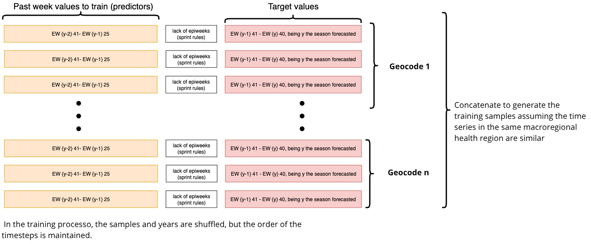
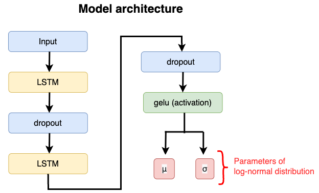
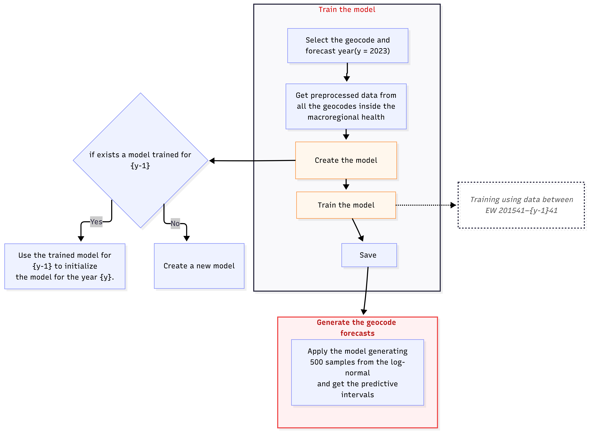

# Dengue oracle 

Long-term dengue forecasting models developed for the [3rd Infodengue-Mosqlimate Dengue Challenge (IMDC) - 2026](https://sprint.mosqlimate.org/), under Optional Challenge 1 – Dengue (City Level), which focuses on predicting dengue incidence across 15 selected Brazilian cities:

- Teixeira de Freitas (BA) — geocode: 2931350  
- Vitória da Conquista (BA) — geocode: 2933307  
- Brejo Santo (CE) — geocode: 2302503  
- Coronel Fabriciano (MG) — geocode: 3119401  
- São José do Rio Preto (SP) — geocode: 3549805  
- Presidente Prudente (SP) — geocode: 3541406  
- Rio Branco (AC) — geocode: 1200401  
- Cruzeiro do Sul (AC) — geocode: 1200203  
- Paraíso do Tocantins (TO) — geocode: 1716109  
- Londrina (PR) — geocode: 4113700  
- Cambé (PR) — geocode: 4103701  
- Cascavel (PR) — geocode: 4104808  
- Aparecida de Goiânia (GO) — geocode: 5201405  
- Campo Novo do Parecis (MT) — geocode: 5102637  
- Novo Gama (GO) — geocode: 5215231  

Optional Challenge 3 – Chikugunya (City Level), which focuses on predicting dengue incidence across 15 selected Brazilian cities:

- Teresina (PI) - geocode: 2211001
- Teixeira de Freitas (BA) - geocode: 2931350
- Montes Claros (MG) - geocode: 3143302
- Coronel Fabriciano (MG) - geocode: 3119401
- Palmas (TO) - geocode: 1721000
- Paraíso do Tocantins (TO) - geocode: 1716109
- Cascavel (PR) - geocode: 4104808
- Xanxerê (SC) - geocode: 4219507
- Cuiabá (MT) - geocode: 5103403
- Campo Novo do Parecis (MT) - geocode: 5102637  

## Team and Contributors:
- Eduardo Correa Araujo (School of Applied Mathematics - (EMAp FGV))

## Repository Structure

Folders: 
* `saved_models`: stores the trained models;  
* `predictions`: stores the predictions generated by the model;
* `diagrams`: Folder containing figures used to explain the model's training methodology.

Scripts: 
* `preprocess_data.py`: aggregates the data for training;  
* `models.py`: defines the model architecture, trains it, and includes functions to generate predictions;  
* `loss_func.py`: contains loss functions that can be used with the model;  
* `train_model.py`: train a model for each geocode;  
* `apply_model.py`: generates predictions for each geocode and validation test.  

Notebooks:
* `example_notebook.ipynb`: Demonstrates how to train the model and generate predictions for a single geocode.
* `plot_predictions.ipynb`: Generates plots of the predictions for dengue.

## Libraries and Dependencies
The libraries required to train the model are listed in the `environment.yml` file. 

## Data and Variables

The files below are required for training the model: 

* `dengue.csv.gz`: time series of probable dengue cases provided by the Mosqlimate team via their FTP server.  
* `map_regional_health.csv`: dataset mapping municipality geocodes to their corresponding regional geocodes provided by the Mosqlimate team via their FTP server.  
* `ocean_climate_oscillations.csv.gz`: ENSO indicator from [NASA JPL](https://sealevel.jpl.nasa.gov/overlay-elnino/), provided by the Mosqlimate team via FTP.  
---

The model proposed is trained using the following covariates: 
  - `casos`: number of probable dengue cases;  
  - `epiweek`: epidemiological week of the probable case (1–52);   
  - `enso`: ENSO indicator from [NASA JPL](https://sealevel.jpl.nasa.gov/overlay-elnino/).

Training and test samples are constructed using normalized data (scaled by maximum values) aggregated across all geocodes within the same macroregional health unit. This approach is based on the assumption that cities belonging to the same macroregional health region exhibit similar temporal dynamics, allowing for an increased number of training samples while still enabling forecasts at the individual geocode level.

### Data Usage Restriction

The model uses the last 89 time steps as input to capture longer dengue cycles. For example, to predict “validation test 1,” the input data spans epidemiological weeks EW202041 through EW202225. The workflow for obtaining the training samples is presented below.

## Model Training

### Model architecture  

The model architecture is shown in the figure below. It consists of two LSTM layers with 64 hidden units, interleaved with two dropout layers. The model outputs the parameters of a log-normal distribution, and is trained using the weighted interval score (WIS) calculated for the predictive intervals of 50%, 80%, 90%, and 95%.

### Predictive Uncertainty

To compute the predictive intervals, we employ the dropout technique during inference (Monte Carlo Dropout), in which dropout layers remain active so that, in each forward pass, a random subset of neurons is temporarily deactivated according to a fixed dropout probability. This induces stochasticity in the network’s outputs, as different dropout masks lead to different estimations of the distribution parameters for each time step. We perform 500 such stochastic forward passes, obtaining 500 sets of parameters for the predictive distribution. From each set of parameters, we draw one sample from the corresponding log-normal distribution. These samples are stored for each region, aggregated to obtain state-level samples, and subsequently used to calculate the predictive intervals.

### Training workflow 
The training workflow is illustrated below. For each geocode, the training set is composed of time series from all cities (that belongs to the macroregional health of the geocode selected) reporting more than 20 cases within a given season and occurring prior to the target season. For example, to generate forecasts for Validation Test 1, data from epidemiological weeks 2015–41 to 2022–40 are used for training.

The model trained in this first stage provides the initial weights for the subsequent stage (Validation Test 2). This sequential transfer of learned weights is repeated until Validation Test 3 is completed.

Each model is trained for up to 500 epochs, with early stopping applied based on the validation loss, using a patience of 25 epochs.

The training pipeline is implemented in the `train_model.py` script, while the generation of forecasts using a trained model is carried out by the `apply_model.py` script.

## References

This model is inspired in the LSTM model developed using tensorflow which code are available [here](https://github.com/eduardocorrearaujo/lstm_transf_to_state/blob/main/models.py). 